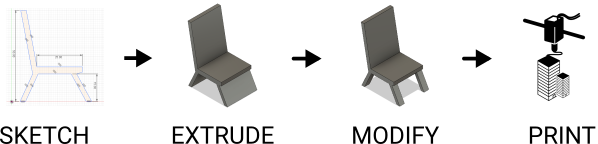

# Design & Make a Miniature Chair
Design á Fusion 360 á 3D Printing

CPL Makerlab: https://sites.google.com/site/cplmakerlab/digital-toolbox
Survey: https://www.surveymonkey.com/r/Y6H3B8Z

What would life be like without chairs?

The humble chair, at least as we imagine it today, dates back to Ancient Egypt and has taken on many different forms throughout history. This simple invention opened up new possibilities for both work and play.

In this tutorial you'll learn how to design a simple chair using Fusion 360. After you learn the steps, you can modify the design to make it your own. 

## Design

Using paper & pencil, first sketch the profile of a chair. Consider who the chair is for, what problem it solves, and where it might be used. Think about the seating angle, how it relates to the human body, and how it supports human posture.

 

**Ergonomics**: Design factors, as for the workplace, intended to maximize productivity by minimizing operator fatigue and discomfort.

**Anthropometry**: The scientific study of measurements of the human body.

Design is a [process](https://dschool.stanford.edu/resources/design-thinking-bootleg) of discovering solutions through observation, imagination, and experimentation. 

Designers often build and test many design prototypes before settling on a final version, as they work through unforeseen problems and limitations that arise.

#### Here are a few links for inspiration:

- [History of Chair Design](http://coshamie.com/history-of-chair-design/)
- [Reference: Common Dimensions, Angles and Heights for Seating Designers](https://www.core77.com/posts/43422/Reference-Common-Dimensions-Angles-and-Heights-for-Seating-Designers)
- [Steelcase Global Posture Study](https://www.steelcase.com/content/uploads/2019/05/global-posture-study.pdf)
- Chair base archetypes: [5 star task base](http://www.suiteny.com/assets/upload/product_images/original/joint-5-star-base-1359.jpg), [4 point base](https://hivemodern.com/public_resources/full/patch-01-4leg-swivel-base-chair-jacco-bregonje-artifort-4.jpg), [4 leg post](http://www.cultfurniturehire.com/wp-content/uploads/2013/01/StackableNavyChair_Galvanized_angle.jpg), [wire form](https://www.hermanmiller.com/products/seating/side-chairs/eames-wire-chairs/), [cantilever](https://www.designformfurnishings.com/wp-content/uploads/2017/10/Cantilever-Chair.jpg). 
- Seat archetypes: [single shell](https://a.1stdibscdn.com/archivesE/upload/f_9224/f_3070652/_C8A7666_l.jpg), [seat & back](https://img0.etsystatic.com/000/0/5870588/il_fullxfull.274626840.jpg)

## MAKE

1. Create a [free Fusion 360 account](https://knowledge.autodesk.com/support/fusion-360/learn-explore/caas/sfdcarticles/sfdcarticles/How-to-activate-start-up-or-educational-licensing-for-Fusion-360.html) if you haven't yet done so.

2. Download [chair-template.f3d](https://github.com/cpl-makerlab/miniature-chair/raw/master/templates/chair-template.f3d) to your Desktop.

3. In Fusion 360, click **File > Open > Open from my computer** and select the chair template.

![]

4. Using the Viewcube, click FRONT so the template is easier to see.

5. Pan & Zoom so that the template is a comfortable size. You can use the bottom toolbar or mouse shortcuts.

Operation | Mouse shortcut
--- | ---
Pan | Hold Middle Mouse Button 
Zoom | Roll Middle Mouse Button
Orbit | Hold Shift + Hold Middle Mouse Button

6. **Sketch > Create Sketch** and click the Origin FRONT plane (highlighted square)

7. **Sketch > Line (L)** to trace the profile of your chair by connecting points A,B,C, etc. Tip: You can disable grid snapping in the bottom toolbar.

8. **Browser > Canvases > Lightbulb Icon** (click lightbulb to hide template)

9. Fusion 360 automatically adds constraints as you draw. These constraints force lines to be equal, parallel, perpendicular, etc. They are represented by tiny little icons places all over your sketch. Try dragging around the points and lines of your chair to see how constraints restrict movement. You can click and delete a constraint or add new ones.

10. Let's add a new constraint to make sure the chair leg bottoms always line up. **Sketch Palette > Constraints > Colinear**. Click the bottom of the left leg, then the bottom of the right leg. You will see a new constraint icon appear. Now try moving one of the leg bottoms, and the other one will automatically adjust to stay level.

11. **Sketch > Sketch Dimension (D)** and click two points or a line to set a dimension. This allows you to set precise dimensions for your sketch, but may cause some weird behavior if your sketch is not constrained well. Max dimensions: 30mm x 30mm x 30mm (~15 min print).

12. **Stop Sketch** (top right menu) to exit sketch mode. Click home icon on Viewcube to reset camera.

13. **Create > Extrude (E)**. Select your chair profile. Drag arrow for a depth of 20-25mm.

14. **Sketch > Create Sketch** on LEFT surface plane (behind the chair). Create a rectangular profile to cut through the bottom of your chair. **Stop Sketch.**

15. **Create > Extrude** the rectangular profile. Extruding through an existing object will remove it (turns red when cutting).

16. (Optional) **Modify > Fillet** to create rounded edges. **Modify > Chamfer** to bevel corners.

17. All done? **File > 3D Print**. Select Makerbot. In Makerbot Desktop export the file to an SD Card, which will be taken over to the 3D Printer to start printing.
Print settings: .3mm, 10% infill, 210¡F, 2 shells. Make sure Raft + Support are turned on. 

